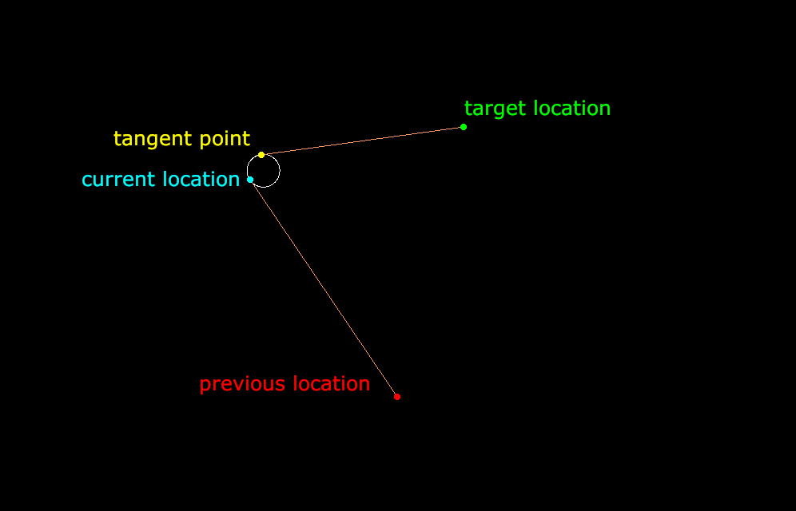
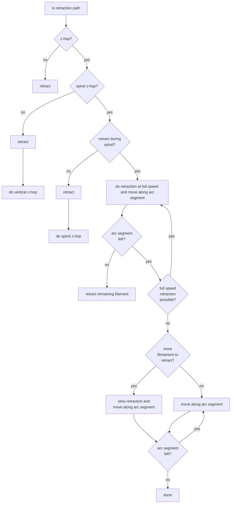

# Gradual z-hop

Z-hop is a widely used feature in 3D printing. It means that you lift the nozzle (mostly when retracting filament, hence) when stopping the extrusion at one place and traveling to somewhere else. The advantage of lifting the nozzle while traveling from A to B (without extruding) is that you avoid scratching your part or getting stuck at any unintended blobs on your print.

However, it often happens that z-hop increases stringing. On top of that, when performing a z-hop on printers with heavy print heads the abrupt stopping of a xy-movement to start a vertical z-movement can cause strong vibrations.

 In order to keep the jerk as constant as possible (hence, minimizing the vibrations) it is possible to perform a z-hop where the extruder does not move straight up vertically at the end of an extrusion but rather increases the z-height while also still moving in x- and y-direction. How the xy-movement is performed determines the type of the gradual z-hop. If it is done linearly it might be done as a ramped or diagonal z-hop or if it is done in form of an arc (viewed from above / on the xy-plane) it is often called a spiral z-hop.


## Spiral Z-Hop Implementation in the Cura Engine

### Behavior and Options
In order to minimize the jerk the spiral z-hop implementation was set up in a way, that the xy-speed is kept constant, relative to the speed of the previous movement, and the speed in z direction is not exceeding the z-hop speed set by the user in the UI. The spiral is in the most simple case only an arc, with a start tangent which is equivalent to the previous movement. The end point of the arc is calculated so that the print head also leaves the arc tangential towards the next target position. The z-height is then interpolated linearly along the arc. If the calculated arc should be too short, so that with a fixed xy-speed the z-speed would exceed the z-hop speed from the UI, a full circle is added to the path, creating a spiral. The z-speed is recalculated and checked again (if it is still too high another full circle is added).
At the end of the travel there is still the standard un-retract and vertical lowering of the print head done.



#### Arc Representation in Gcode
Even if there are gcode commands for arc travels (`G2`/`G3`) it was decided to implement a discretized version for now which is based on `G0` commands (and in case of retraction `G1`, see below). In this way the code will be compatible with a higher range of printers (where the board is not supporting `G2`/`G3` commands). However, the code and the arc calculation are set up in a way, that a continuous version, using `G2`/`G3`, can easily be added, because all the relevant information for these commands are part of its public interface.

#### Retraction
In order to prevent the extruder from stopping for only the retraction, the retraction can be done during the gradual z-hop. In this case, the retraction is spread over the first `n` steps of the arc. The first `n-1` steps are then set up in such fashion, that the retraction amount is exactly what is required to retract with the given retraction speed considering the fixed xyz-speed for the movement. The following step is then a slower retraction where the remaining retraction is not sufficient anymore for a full speed retraction step. In the rare case, where the retraction can not be fully done during the arc, a normal retraction (with no xyz-movement) is done after the gradual z-hop to retract the remaining filament.



#### UI settings accessible to the user
The following options are defined by the user (in experimental settings):
- What type of z-hop is used: vertical or spiral
- The arc / spiral radius
- Whether the retraction is done before or during the gradual z-hop

### Edge Cases
- The provided arc radius is zero:  
The calculation exits. The radius has to be a positive value larger than zero.

- The target position is located directly on the underlying circle for the arc:  
The arc end point is set to the target position.

- The target position is located inside the underlying circle for the arc:  
A full circle is done. Afterward the travel is not tangential towards the target position.

- The previous, current and target position are colinear and follow the underlying line in this order:  
A full circle, located to the right of the line, is done in clockwise direction.

- The arc might exit the print volume, because the underlying circle reaches outside the printer bounds:  
A normal, vertical z-hop is done.

- The target position is the current one:  
A full circle is done.


### Feature Interactions
When using combing with the gradual z-hop, then the z-hop is done after the first combing travel inwards of the layer polygon. This means, that the tangent at the beginning of the arc and its xy-speed is determined by the combing travel. For jerk minimization it is recommended to turn of combing when using the spiral z-hop.

### Files and relevant locations in the code

#### Calculating the arc / spiral path
In the `pathPlanning` source folder there is a file `ArcPathCalculator.cpp` which contains a class covering all the logic to create the path based on the relevant information like the arc radius, the positions, the speeds and how the arc can be discretized.

#### Writing the path to gcode
The function to actually create the path for the gradual z-hop and to write the corresponding gcode is part of `GCodeExport` and is called `writeSpiralZhopStart`.

#### Calling the spiral z-hop gcode generation
Inside `LayerPlan::writeGCode` in `LayerPlan.cpp` the function `writeSpiralZhopStart` is called when a path is a retraction, z-hop is activated and set to type spiral.

Further location where the gradual z-hop, might be added in the future:
- `GCodeExport::writeTravel` in `gcodeExport.cpp`
-`LayerPlan::writeGCode` in LayerPLan.cpp (maybe add gradual z-hop when it is the end of the extruder plan or path)
- maybe also in `LayerPlan::writeGCode` where `gcode.writeZhopStart(MM2INT(3.0))` is called if setting `"cool_lift_head"` is set a


## Mathematical Background
To calculate the tangent points $P_1 = (x_1,y_1)$ and $P_2 = (x_2,y_2)$ on a given circle towards a desired target point $P_0 = (x_0,y_0)$ in 2D:

$${x_{1,2} = \frac{x_0 * r^2}{d^2} \pm \frac{-y_0 * r^2}{d^2} \sqrt{d^2-r^2}}$$
$${y_{1,2} = \frac{y_0 * r^2}{d^2} \pm \frac{x_0 * r^2}{d^2} \sqrt{d^2-r^2}}$$

 Where $r$ is the radius of the circle and $d$ is the distance between the circle center and the target point $P_0$. The vectors $e_1$ and $e_2$ are the base vectors which span the local coordinate system towards $P_0$ with the circle center at its origin.
 \


For more detailed information read: https://en.wikipedia.org/wiki/Tangent_lines_to_circles


Note: In this implementation, all angle calculations are done with positive angles in the interval [0,2pi] considering a full counterclockwise, circle.

## Test prints
TODO test prints with cura.

## Other Gradual Z-Hop Implementations

The following sources were found to use / implement a gradual z-hop.
#### Spiral Z-Hop
- [Bamboo Studio](https://github.com/bambulab/BambuStudio) (based on the Prusa Slicer, GNU Affero General Public License, version 3)
- [Orca Slicer](https://github.com/SoftFever/OrcaSlicer) (fork of Bambu Studio, GNU Affero General Public License, version 3)
#### Ramped / Diagonal Z-Hop
- [Diagonal Z-Hop Post-Processor](https://teachingtechyt.github.io/diagonalZhop.html) (Code not available / not found until now)

### Bambu Studio Implementation Insights
The spiral z-hop is part of the Slic3r library and done in 
```std::string GCodeWriter::_spiral_travel_to_z(double z, const Vec2d &ij_offset, const std::string &comment) ``` 
where both the xy and z coordinates are adapted / translated to gcode. However, the coordinates themselves appear to be calculated in ```std::string GCodeWriter::travel_to_xyz(const Vec3d &point, const std::string &comment)``` (function has a notice about having to be fixed which appears to be mainly related to the feed rate calculation) considering a certain radius dependent on the slope. ```travel_to_xyz``` is then called in ```std::string GCode::travel_to(const Point &point, ExtrusionRole role, std::string comment)``` and is taking care of traveling from the current point to a target point. 
In more detail: In ```travel_to_xyz``` the center of the circle is calculated and the ```Slic3r::GCodeG2G3Formatter``` uses the [G2 / G3 command](https://marlinfw.org/docs/gcode/G002-G003.html) to perform the spiral z-hop. However, these two commands have two versions, one is using the circle center and one is using the circle radius for the arc creation. At least in C'n'C milling the advantage of using the center version is, that it allows you to [double-check that you keep the same distance from both endpoints](https://www.cnccookbook.com/cnc-g-code-arc-circle-g02-g03/), and there it also appears to be more accurate according to [this source](https://linuxcnc.org/docs/html/gcode/g-code.html#gcode:g2-g3).

From what is seen until now the spiral z-hop implementation has not changed in the Orca Slicer fork.

